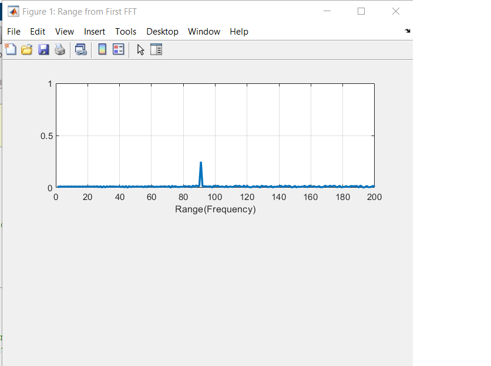
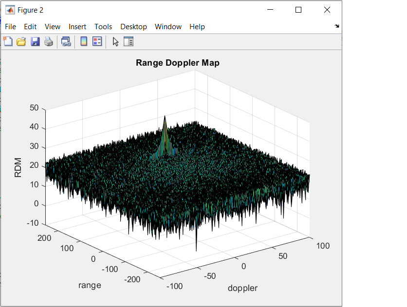
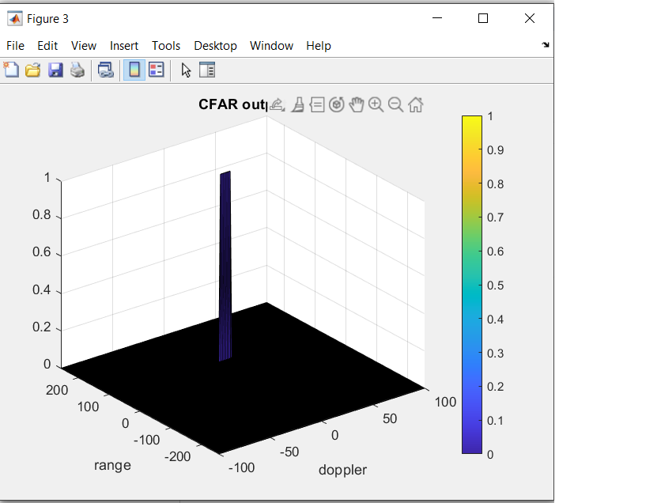

# Radar_Target_Generation_Detection

### Project Overview

 

-------------------------------------------------
### SW Pipeline

The SW pileline is composed about 5 steps :
- Step 1 : FMCW waveform configuration in accordance with the system requirements
- Step 2 : Position and velocity definition and simulation of the movement
- Step 3 : Signal transmission and reception to determine the beat signal
- Step 4 : FFT1 processing on the received signal to determine the range (FFT2 for the velocity is already implemented)
- Step 5 : CFAR processing ont the output of the FFT2 to display the target

-----------------------------------------------------
#### Step 1 + Step2
The first step hast two targets :
- implementation of the radar design specification written in the data sheet. 
- configuration from the FMCW (FRequency Modulated COntinuous Wave), this technology low cost is very used in the automative industry.
The most important configuration are the Bandwith configuration (Y-axis), the Tchirp(X-axis) configuration and the slope of the chirp signal.

The first step hast one targets :
 - definition from the target initial position and velocity in accordance with requirements

 
----------------------------------------------------------
                                                               
#### Step3:
The second step hast one target :
- implementation of the signal generation and simulation of a moving target with the slop of the chirp signal calculated in the first step.
The most important think is the generation of a transmitted and a received signal with the help of the Td (delay) between the two linear lines.

The most important think is the generation of a transmitted and a received signal

 

---------------------------------------------------------------
#### Step4:

The step 4 is composed about 2 parts : the FFT1 fot the range measurement and the FFT2 for the velocity estimation.
The target is to pass from the time domain to the frequency domain. The FFT runs for every sample on each chirp.We generate a range FFT block of N*Number of chirps.

The second FFT is already implemented and resposble for the velocity estimation.

 

 

---------------------------------------------------------------------
#### Step5:

The step 5 has for target to configure a dynamic threshold to detect the target but without false alarm. That why this thershold must be dynamicelly updated.
The results of the FFT2 are the input of this step.
We must firstly define the 3 types of cell: target cells, training cells ans guard cells. The training cells are very important because the average of these training celles permitt to udate the threshold.
The SNR offset is important because it's the threshold factor : he permitts to scale the noise threshold. He his define with the result from the FFT1 (amplitude of the top).

After that, we design a loop such that it slides the CUT across range doppler map bygiving margins at the edges for Training and Guard Cells.
For every iteration sum the signal level within all the training cells. For the sum convert the value from logarithmic to linear, we use the db2pow function.
function. Average the summed values for all of the training cells used. After averaging convert it back to logarithimic using pow2db.
Further we add the offset to it to determine the threshold. Next, we compare the signal under CUT with this threshold. 
If the CUT level > threshold assign it a value of 1, else equate it to 0.

The process above will generate a thresholded block, which is smaller than the Range Doppler Map as the CUT cannot be located at the edges of matrix. 
Hence,few cells will not be thresholded. To keep the map size same set those values to 0. 

 

 
                                                                

