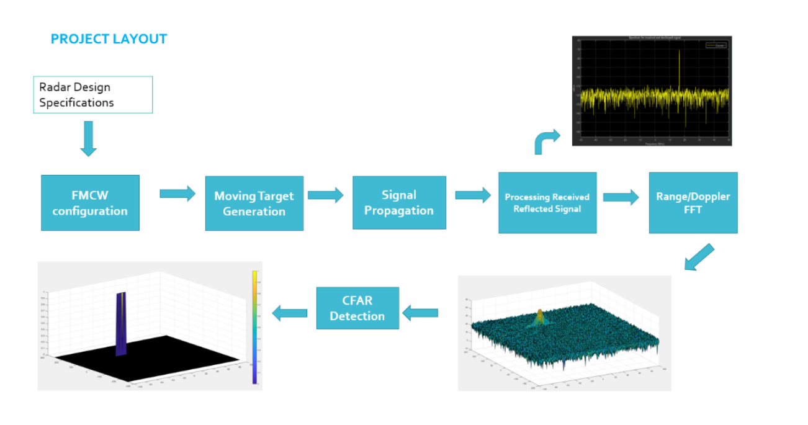
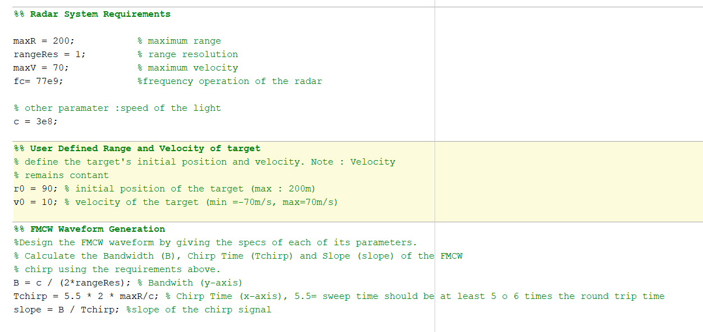
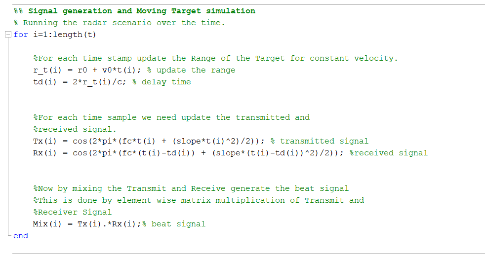
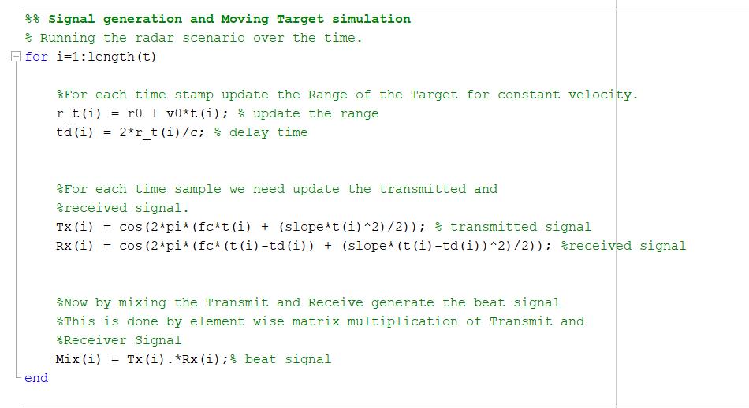
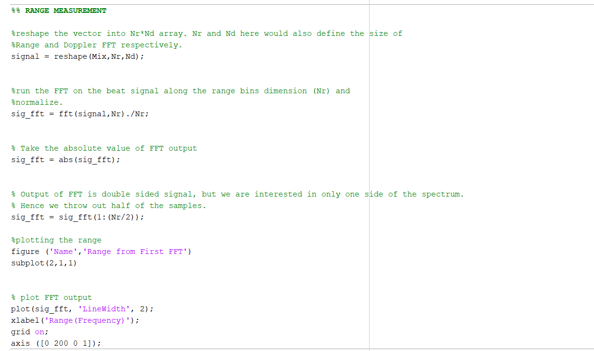
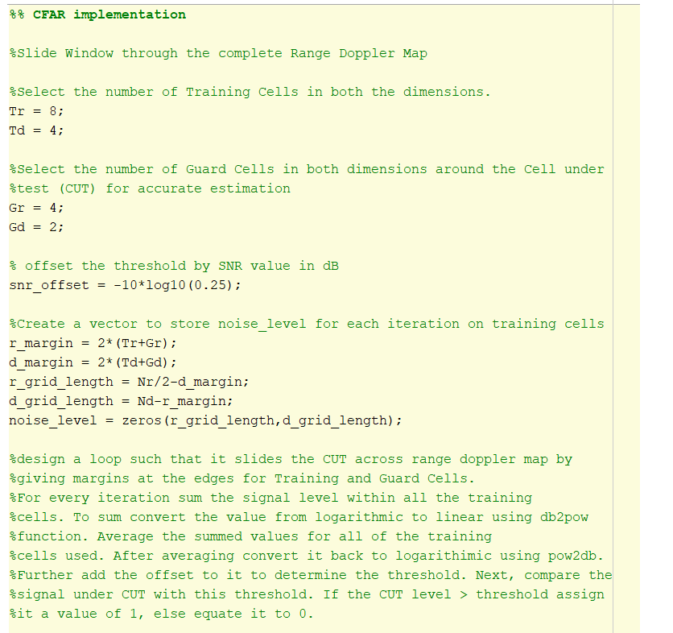
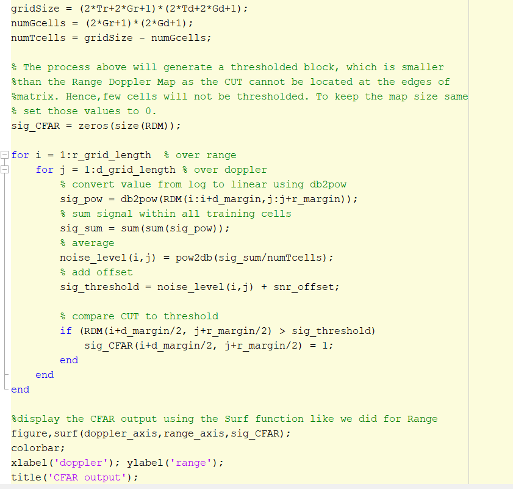

# Radar_Target_Generation_Detection

### Project Overview

 

### SW Pipeline

The SW pileline is composed about 5 steps :
- Step 1 : FMCW waveform configuration in accordance with the system requirements
- Step 2 : Position and velocity definition and simulation of the movement
- Step 3 : Signal transmission and reception to determine the beat signal
- Step 4 : FFT1 processing on the received signal to determine the range (FFT2 for the velocity is already implemented)
- Step 5 : CFAR processing ont the output of the FFT2 to display the target

#### Step 1: 

 

#### Step 2: 

 

#### Step3:

 

#### Step4:

 

#### Step5:

 

 

